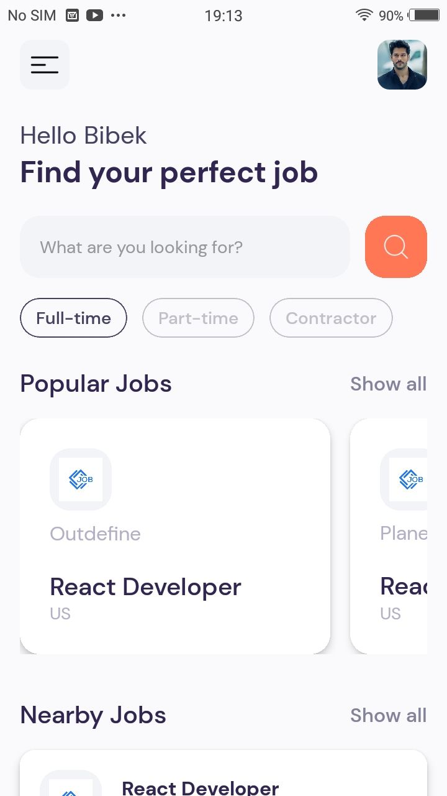

[](https://wakatime.com/badge/user/558bdd52-529b-4833-baae-cac62f99ff8a/project/018c3953-5d44-4306-b535-f44153a8d12e)
# React Native Jobs
<p align="center">
  
</p>

🌐 A fantastic cross-platform app built using React Native that runs seamlessly on the web, Android, and iOS.

## Features

- 🚀 Cross-platform compatibility
- 📱 Native performance on Android and iOS
- 🌐 Web support for a broader audience
- 🔄 Real-time job updates using the JSearch API from Rapid API

## Screenshots

<details>
  <summary>Click to expand</summary>
  <p align="center">
    
    
    
    
    
  </p>
</details>

## How to Install

```bash
# Clone the repository
git clone https://github.com/Bibker/react-native-jobs.git

# Navigate to the project folder
cd react-native-jobs

# Install dependencies
npm install
